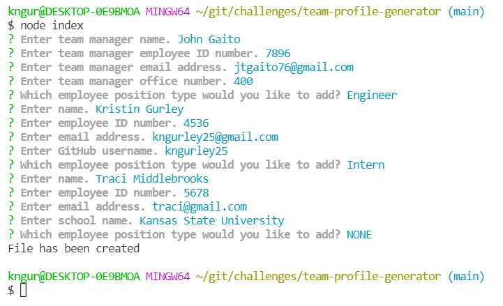
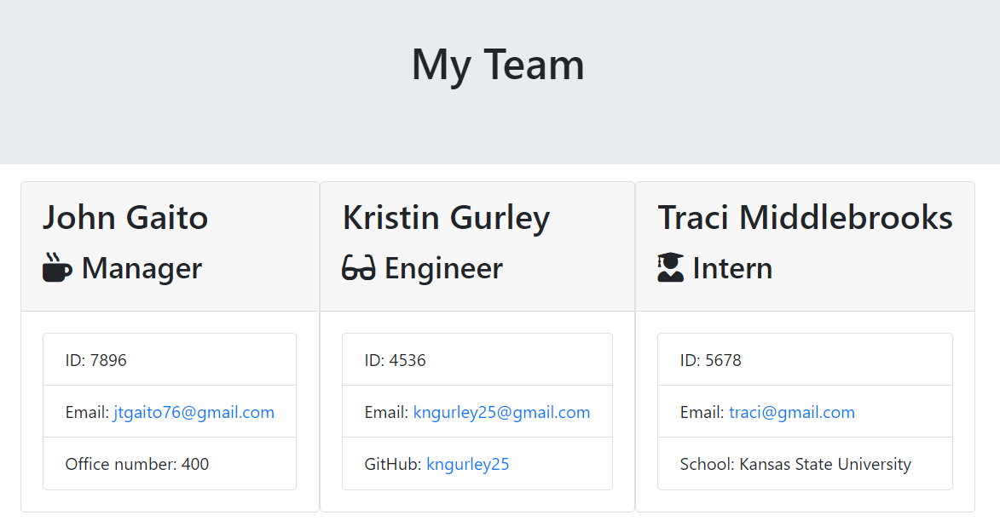

# team-profile-generator

## Description
An application in which a user can generate a webpage to display a team of colleagues.
The webpage displays information that takes in user input from the command line given specific prompts.

## Installation
To install this application:
1. Clone repository
1. Download npm dependencies with 'npm install' command

## Usage
To use this application:
1. Invoke application start with 'node index.js' command
1. Answer command line prompts
1. View the generated html file in the distribution directory (./dist)

View this walk-through on how to use the team profile generator application:  
[Demo Video](https://watch.screencastify.com/v/AkmmzlRk62QTwUf0etzD)

## Technologies
- JavaScript
- node.js
- node package manager (npm)
	- inquirer
	- jest

## Demo Images
*Preview of command line prompts*

*Preview of generated markdown file*

